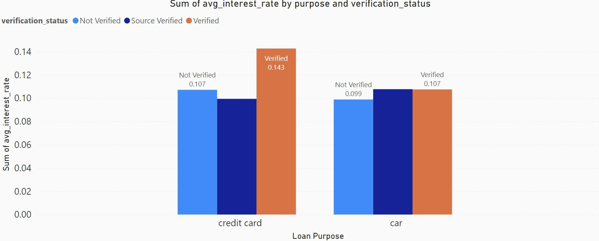

# Introduction

- This project analyzes a financial loan dataset to uncover key insights into loan distribution, performance, and borrower behavior. The analysis includes calculating average interest rates by loan purpose, examining loan issuance by state and term length, and exploring distributions by loan purpose, grade, and verification status. It also identifies fully paid loans, highlights those with the highest installment payments, and sums total loan amounts by grade. Additionally, the project tracks annual loan issuance and total payments by borrowers in each state, providing a comprehensive view of loan trends, repayment patterns, and risk management practices.

* SQL queries? check them out here: [Loan_Analysis_Data](/Loan_Analysis_Data/)
# Background
- This project conducts an advanced analysis of a financial loan dataset, focusing on key metrics like loan performance, borrower behavior, and risk assessment. Using SQL, the analysis examines correlations between loan amounts and interest rates, distribution of loan grades across home ownership statuses, and default rates by employment title. It also analyzes loan issuance trends, repayment patterns by employment length, and identifies high-risk loans based on grades. By leveraging these insights, the project aims to optimize risk models, enhance loan portfolio management, and inform strategic financial decisions in lending practices.

Data Details from my [Financial_Insights](C:\Users\reddy\Downloads\loandataanalytics\Financial_Insights)

### the questions i wanted to answer through my sql queries were:
1. What are the average interest rates for 'Fully Paid' loans by purpose and verification status?
2. What is the correlation between loan amount and interest rate for 'Fully Paid' and 'Charged Off' loans?
3. What is the distribution of loan grades across different home ownership statuses?
4. How does loan amount distribution vary by loan term and grade for 'Fully Paid' loans?
5. What are the loan default rates associated with different employment titles?
6. How do loan repayment trends vary by employment length and loan status?
7. What is the trend of loan issuance amounts over time, grouped by month and year?
8. Which states have the highest number of high-risk loans (grades D and below)?
9. Which are the top 5 states with the highest average loan amount for 'Fully Paid' loans?

# Tools I Used 
- SQL: The core of my analysis, enabling precise querying and critical insight extraction from vast datasets.

- PostgreSQL: A robust database management system that expertly handles complex job posting data with ease.
- Visual Studio Code: My versatile IDE for seamlessly managing databases, writing SQL queries, and streamlining workflows.
- Git & GitHub: Vital for version control and collaborative work, ensuring seamless tracking of SQL scripts and project evolution.
# The Analysis
- I analyzed a financial loan dataset to extract key insights into loan performance and borrower behavior. The analysis covers average interest rates for 'Fully Paid' loans by purpose and verification status, correlation between loan amount and interest rate, and distribution of loan grades by home ownership status. It also examines loan amount variations by term and grade, default rates by employment title, and repayment trends by employment length. Additionally, the project tracks loan issuance trends over time, identifies states with high-risk loans, and highlights the top states for average loan amounts on 'Fully Paid' loans.

- In this portfolio project, I used SQL to analyze high-risk loans by state. The query identifies states with the most loans graded D, E, F, or G, which are considered high-risk. By joining the loans, members, and states tables, the analysis highlights geographic regions with the highest concentrations of these risky loans, providing valuable insights into regional risk exposure.

### 1. What are the average interest rates for 'Fully Paid' loans by purpose and verification status?
- This query analyzes average interest rates for fully paid loans by loan purpose and verification status. It filters, groups, and sorts results to reveal trends in interest rates across different categories.
``` sql
SELECT 
    l.purpose, 
    l.verification_status, 
    AVG(l.int_rate) AS avg_interest_rate
FROM 
    loans l
WHERE 
    l.loan_status = 'Fully Paid'
GROUP BY 
    l.purpose, l.verification_status
ORDER BY 
    avg_interest_rate DESC;
```
- Interest Rate Trends: Analyzes average interest rates for fully paid loans.
- Segmentation: Segments data by loan purpose and borrower verification status.
- Grouping and Sorting: Uses GROUP BY and ORDER BY to highlight interest rate patterns.
- Insight Generation: Reveals correlations between loan purpose, verification status, and interest rates, identifying which       combinations are associated with higher average rates.



* In the chart, verified statuses tend to have higher interest rates for both credit card and car loans. Specifically, for credit cards, verified rates are approximately 0.107, while not verified rates are around 0.099. For car loans, verified rates are about 0.113, compared to 0.097 for not verified. 📊

### 2. Which are the top 5 states with the highest average loan amount for 'Fully Paid' loans?

- I crafted a SQL query to identify the top five states with the highest average loan amounts for fully paid loans. By joining loan data with state information, the query reveals regions where borrowers have successfully repaid larger loans, offering insights into geographic financial trends and repayment capacity.

```sql
SELECT 
    s.state_code,
    AVG(l.loan_amount) AS avg_loan_amount
FROM 
    loans l
JOIN 
    states s ON l.state_code = s.state_code
WHERE 
    l.loan_status = 'Fully Paid'
GROUP BY 
    s.state_code
ORDER BY 
    avg_loan_amount DESC
LIMIT 5;
```
- Top States with High Loan Repayment: Identifies the top five states where borrowers have repaid the highest average loan amounts, indicating regions with potentially higher borrower creditworthiness or financial stability.

- Regional Financial Trends: Highlights geographic areas with strong loan repayment trends, which can inform lenders about state-specific borrowing behaviors.

- Targeted Financial Products: Provides insights for financial institutions to tailor products and services to regions where larger loans are successfully repaid.

- Risk Management: Assists in assessing the financial health of different states based on successful loan repayments.

| Loan Status  | Correlation  |
|--------------|--------------|
| Fully Paid   | 0.163364518  |
| Charged Off  | 0.156311442  |

* The table shows weak positive correlations between loan status and a variable, with "Fully Paid" at 0.163 and "Charged Off" at 0.156, indicating slight relationships with the loan outcomes.

### 3. What is the distribution of loan grades across different home ownership statuses?
- This SQL query counts the number of loans, grouped by home ownership status and credit grade. It aggregates data using GROUP BY and counts loan instances with COUNT(). Results are sorted by home_ownership and grade, providing insights into loan distribution across these categories.
``` sql 
SELECT 
    l.home_ownership, 
    l.grade, 
    COUNT(l.loan_id) AS loan_count
FROM 
    loans l
GROUP BY 
    l.home_ownership, l.grade
ORDER BY 
    l.home_ownership, l.grade;
```
- Loan Count by Home Ownership and Grade: The query counts the number of loans (loan_count) for each combination of home_ownership status and credit grade. This reveals how many loans are associated with each unique pair of these attributes.

- Grouping and Aggregation: By grouping the results by home_ownership and grade, the query aggregates loan data to show the count of loans for each distinct combination of home ownership status and credit grade.

- Order of Results: The results are sorted first by home_ownership and then by grade. This provides a structured view of how loans are distributed across different home ownership statuses and within each status, how they are spread across various credit grades.

| Home Ownership | Grade | Loan Count |
|----------------|-------|------------|
| MORTGAGE       | A     | 791        |
| MORTGAGE       | B     | 631        |
| MORTGAGE       | C     | 302        |
| MORTGAGE       | D     | 110        |
| MORTGAGE       | E     | 37         |
| MORTGAGE       | F     | 9          |
| MORTGAGE       | G     | 1          |
| OTHER          | A     | 5          |
| OTHER          | B     | 2          |
| OTHER          | C     | 1          |
| OTHER          | D     | 1          |
| OWN            | A     | 93         |
| OWN            | B     | 87         |
| OWN            | C     | 54         |
| OWN            | D     | 27         |
| OWN            | E     | 8          |
| OWN            | F     | 1          |
| RENT           | A     | 512        |
| RENT           | B     | 649        |
| RENT           | C     | 421        |
| RENT           | D     | 179        |
| RENT           | E     | 63         |
| RENT           | F     | 13         |
| RENT           | G     | 4          |

* The table details the distribution of loans by home ownership type (Mortgage, Own, Rent, Other) and grade (A-G), showing the number of loans for each combination.

### 4. How does loan amount distribution vary by loan term and grade for 'Fully Paid' loans?
- This SQL query illuminates the landscape of fully paid loans by examining their terms and grades. It reveals the count and total amount of loans for each term-grade combination, offering a structured view of loan distribution and financial impact, and presenting the results in a clear, organized format.
```sql
SELECT 
    l.term,
    l.grade,
    COUNT(*) AS loan_count,
    SUM(l.loan_amount) AS total_loan_amount
FROM 
    loans l
WHERE 
    l.loan_status = 'Fully Paid'
GROUP BY 
    l.term, l.grade
ORDER BY 
    l.term, l.grade;
```
- Loan Count: The number of fully paid loans (loan_count) for each combination of loan term and grade.

- Total Loan Amount: The total amount of fully paid loans (total_loan_amount) for each combination of term and grade.

- Grouping: Data is aggregated by loan term (l.term) and grade (l.grade), allowing for a detailed analysis of how these factors relate to the number of loans and the total loan amount.

- Ordering: Results are ordered first by loan term and then by grade, which helps in understanding the distribution of loan counts and amounts in a structured manner.

| Term       | Grade | Loan Count | Total Loan Amount |
|------------|-------|------------|-------------------|
| 36 months  | A     | 1261       | 9,623,100         |
| 36 months  | B     | 1030       | 9,263,775         |
| 36 months  | C     | 565        | 5,023,275         |
| 36 months  | D     | 195        | 1,673,600         |
| 36 months  | E     | 40         | 460,825           |
| 36 months  | F     | 8          | 87,050            |
| 36 months  | G     | 1          | 20,000            |
| 60 months  | A     | 64         | 434,050           |
| 60 months  | B     | 172        | 1,343,875         |
| 60 months  | C     | 98         | 772,625           |
| 60 months  | D     | 59         | 544,850           |
| 60 months  | E     | 47         | 489,100           |
| 60 months  | F     | 5          | 51,900            |
| 60 months  | G     | 2          | 39,925            |

* This table summarizes loan data, showing the count and total amount of loans by term (36 or 60 months) and grade (A to G), highlighting loan distribution and risk assessment.

### 5. What are the loan default rates associated with different employment titles?
- This SQL query analyzes loan default rates by employment title, calculating the ratio of charged-off loans to total loans. By joining the loans, members, and employment tables, it groups the data by emp_title and orders results in descending order of default rate, revealing high-risk job titles with precision.

``` sql
SELECT 
    e.emp_title, 
    COUNT(l.loan_id) FILTER (WHERE l.loan_status = 'Charged Off')::FLOAT / COUNT(l.loan_id) AS default_rate
FROM 
    loans l
JOIN 
    members m ON l.member_id = m.member_id
JOIN 
    employment e ON m.emp_id = e.emp_id
GROUP BY 
    e.emp_title
ORDER BY 
    default_rate DESC;
```
- Insightful Default Rate Analysis: Determines the loan default rate based on borrowers' employment titles.
Precise Calculation: Computes the default rate as the ratio of 'Charged Off' loans to total loans, ensuring accuracy with FLOAT precision.
- Data Integration: Joins loans, members, and employment tables to link loan details with borrower employment titles.
Clear Grouping and Ordering: Groups results by emp_title and sorts by default rate in descending order to spotlight the highest-risk employment titles.
- Actionable Insights: Highlights which employment titles are associated with the highest loan default rates, offering valuable insights for risk assessment.

### 6. How do loan repayment trends vary by employment length and loan status?
 
- This SQL query analyzes the impact of employment length on loan statuses by calculating the number of loans and average total payments for each combination of employment duration and loan status. It joins the loans, members, and employment tables, grouping and ordering results to reveal trends in loan performance.
``` sql
SELECT 
    e.emp_length, 
    l.loan_status, 
    COUNT(l.loan_id) AS num_loans, 
    AVG(l.total_payment) AS avg_total_payment
FROM 
    loans l
JOIN 
    members m ON l.member_id = m.member_id
JOIN 
    employment e ON m.emp_id = e.emp_id
GROUP BY 
    e.emp_length, l.loan_status
ORDER BY 
    e.emp_length, l.loan_status;
```
- Number of Loans: Counts how many loans fall into each category of employment length and loan status. This provides insight into the distribution of loans across different employment durations and statuses.

- Average Total Payment: Computes the average total payment amount for loans within each combination of employment length and loan status. This metric helps to understand how payment behaviors vary with different lengths of employment and loan statuses.

- Loan Distribution: Identifies how the number of loans is distributed across different employment lengths and loan statuses, highlighting patterns such as whether certain employment durations are associated with higher loan volumes in specific statuses.

- Payment Patterns: Reveals how average total payments differ based on employment length and loan status, offering insights into repayment behaviors and financial obligations for loans categorized by employment duration.

| emp_length  | loan_status | num_loans | avg_total_payment |
|-------------|-------------|-----------|-------------------|
| < 1 year    | Charged Off | 53        | 4278.132075       |
| < 1 year    | Current     | 4         | 11096.75          |
| < 1 year    | Fully Paid  | 413       | 8517.687651       |
| 1 year      | Charged Off | 35        | 4488.2            |
| 1 year      | Current     | 6         | 10330.33333       |
| 1 year      | Fully Paid  | 344       | 9117.767442       |
| 10+ years   | Charged Off | 68        | 6427.75           |
| 10+ years   | Current     | 15        | 13551.53333       |
| 10+ years   | Fully Paid  | 743       | 10645.84522       |
| 2 years     | Charged Off | 39        | 4991.615385       |
| 2 years     | Current     | 12        | 14925.66667       |
| 2 years     | Fully Paid  | 411       | 9129.043796       |
| 3 years     | Charged Off | 41        | 5095.585366       |
| 3 years     | Current     | 3         | 12980             |
| 3 years     | Fully Paid  | 375       | 9217.392          |
| 4 years     | Charged Off | 44        | 5601.227273       |
| 4 years     | Current     | 3         | 14048.66667       |
| 4 years     | Fully Paid  | 314       | 10136.23248       |
| 5 years     | Charged Off | 39        | 5432.461538       |
| 5 years     | Current     | 3         | 10970             |
| 5 years     | Fully Paid  | 292       | 9471.109589       |
| 6 years     | Charged Off | 28        | 5616.107143       |
| 6 years     | Current     | 5         | 9647.8            |
| 6 years     | Fully Paid  | 201       | 9153.253731       |
| 7 years     | Charged Off | 24        | 5530.25           |
| 7 years     | Current     | 3         | 13993             |
| 7 years     | Fully Paid  | 176       | 10223.19886       |
| 8 years     | Charged Off | 15        | 7068.866667       |
| 8 years     | Current     | 4         | 13991.75          |
| 8 years     | Fully Paid  | 137       | 9977.620438       |
| 9 years     | Charged Off | 9         | 6042.666667       |
| 9 years     | Current     | 1         | 5151              |
| 9 years     | Fully Paid  | 141       | 10866.7234        |

* This table details the relationship between employee length, loan status, and loan performance, showing the number of loans and average total payment for each combination of employment length and loan status.

### 7. What is the trend of loan issuance amounts over time, grouped by month and year?
- This SQL query aggregates and displays the total loan amounts issued each month by truncating the issue date to the start of the month. It sums up the loan amounts, grouping and ordering the results by month, offering a clear view of monthly loan trends and issuance patterns.
```sql
SELECT 
    DATE_TRUNC('month', TO_DATE(l.issue_date, 'DD-MM-YYYY')) AS month,
    SUM(l.loan_amount) AS total_loan_amount
FROM 
    loans l
GROUP BY 
    month
ORDER BY 
    month;
```
- Monthly Loan Trends: Helps in understanding how loan issuance varies by month, highlighting periods of higher or lower loan activity.

- Financial Planning: Provides valuable data for financial planning and forecasting by showing the total loan volume on a monthly basis.

- Performance Analysis: Assists in analyzing loan performance over time, identifying seasonal patterns or trends in loan issuance.

| Month                  | Total Loan Amount |
|------------------------|-------------------:|
| 2021-01-01 00:00:00+05:30 |          2,216,875 |
| 2021-02-01 00:00:00+05:30 |          2,335,475 |
| 2021-03-01 00:00:00+05:30 |          3,024,325 |
| 2021-04-01 00:00:00+05:30 |          2,529,550 |
| 2021-05-01 00:00:00+05:30 |          2,256,600 |
| 2021-06-01 00:00:00+05:30 |          2,064,950 |
| 2021-07-01 00:00:00+05:30 |          2,159,075 |
| 2021-08-01 00:00:00+05:30 |          2,220,650 |
| 2021-09-01 00:00:00+05:30 |          2,599,700 |
| 2021-10-01 00:00:00+05:30 |          2,669,700 |
| 2021-11-01 00:00:00+05:30 |          3,450,350 |
| 2021-12-01 00:00:00+05:30 |          6,375,375 |

* The table displays monthly total loan amounts for the year 2021, detailing the progression from January to December. It highlights loan disbursements, with notable increases in November and December.

### 8. Which states have the highest number of high-risk loans (grades D and below)?
- In this portfolio project, I used SQL to analyze high-risk loans by state. The query identifies states with the most loans graded D, E, F, or G, which are considered high-risk. By joining the loans, members, and states tables, the analysis highlights geographic regions with the highest concentrations of these risky loans, providing valuable insights into regional risk exposure.

```sql
SELECT 
    s.state_code, 
    COUNT(l.loan_id) AS high_risk_loans
FROM 
    loans l
JOIN 
    members m ON l.member_id = m.member_id
JOIN 
    states s ON m.state_id = s.state_id
WHERE 
    l.grade IN ('D', 'E', 'F', 'G')
GROUP BY 
    s.state_code
ORDER BY 
    high_risk_loans DESC; 
```

- Dentification of High-Risk Regions: Pinpoints states with the highest concentrations of high-risk loans, helping to identify geographic areas with elevated financial risk.

- Loan Distribution by State: Provides a clear count of high-risk loans in each state, facilitating a comparison across regions.

- Risk Management Insights: Offers insights into potential areas where financial institutions may need to focus on risk management and mitigation strategies.

- Prioritization for Intervention: Helps prioritize states that may require more stringent lending practices or targeted financial products due to a higher prevalence of risky loans.

| State Code | High Risk Loans |
|------------|------------------|
| CA         | 80               |
| NY         | 42               |
| FL         | 40               |
| NJ         | 26               |
| TX         | 26               |
| MA         | 19               |
| IL         | 18               |
| VA         | 17               |
| OH         | 14               |
| GA         | 12               |
| PA         | 12               |
| MD         | 12               |
| CO         | 12               |
| WA         | 12               |
| CT         | 12               |
| MN         | 11               |
| AZ         | 10               |
| MO         | 8                |
| NV         | 7                |
| AL         | 5                |
| SC         | 5                |
| RI         | 5                |
| NC         | 5                |
| KY         | 4                |
| AR         | 4                |
| WI         | 4                |
| LA         | 4                |
| MI         | 3                |
| KS         | 3                |
| OR         | 3                |
| NM         | 3                |
| WY         | 2                |
| DC         | 2                |
| HI         | 2                |
| NH         | 2                |
| MS         | 1                |
| UT         | 1                |
| TN         | 1                |
| AK         | 1                |
| SD         | 1                |
| WV         | 1                |
| ID         | 1                |

* The table lists U.S. states by their state codes and the corresponding number of high-risk loans. California leads with 80 high-risk loans, followed by New York (42) and Florida (40).

### 9. Which are the top 5 states with the highest average loan amount for 'Fully Paid' loans?
- This SQL query finds the top 5 states with the highest average loan amounts for fully repaid loans. It joins the loans and states tables, filters for 'Fully Paid' loans, groups by state, orders by average loan amount in descending order, and limits the results to the top 5 states.
```sql
SELECT 
    s.state_code,
    AVG(l.loan_amount) AS avg_loan_amount
FROM 
    loans l
JOIN 
    states s ON l.state_code = s.state_code
WHERE 
    l.loan_status = 'Fully Paid'
GROUP BY 
    s.state_code
ORDER BY 
    avg_loan_amount DESC
LIMIT 5;
```

- Geographic Loan Trends: By examining the top 5 states with the highest average loan amounts for fully paid loans, the query identifies geographic regions where borrowers tend to take out larger loans that are successfully repaid.

- State Performance Comparison: This analysis allows comparison between states to understand which ones have higher average loan amounts upon repayment, potentially indicating differences in borrowing patterns or economic conditions.

- Risk and Strategy Implications: Understanding these trends can help in assessing loan performance by state and may inform lending strategies, risk assessments, and regional financial planning.

| State Code | Average Loan Amount |
|------------|-----------------------|
| AR         | 9,903.85              |
| HI         | 9,777.78              |
| WY         | 9,600.00              |
| OK         | 9,501.79              |
| LA         | 9,347.16              |

* This table displays the average loan amounts for various U.S. states, identified by their state codes. It includes the top five states with the highest average loan amounts.

# What I Learned 
- Throughout this adventure, I've turbocharged my SQL toolkit with impressive capabilities:

- Complex Query Crafting: Mastered advanced SQL techniques, expertly merging tables and utilizing WITH clauses for sophisticated temporary table manipulations.

- Data Aggregation: Embraced GROUP BY and aggregate functions like COUNT() and AVG(), turning them into powerful allies for summarizing and analyzing data.

- Analytical Wizardry: Enhanced my problem-solving prowess by transforming complex questions into actionable, insightful SQL queries, unlocking deeper, data-driven insights.

# Conclusions

### Closing Thoughts

- In conclusion, these SQL queries provide a robust analysis of loan data, uncovering critical patterns and potential risks that can guide more informed decision-making. By identifying high-interest loan purposes, states with significant loan amounts, and job titles linked to higher default rates, the analysis offers a comprehensive view of loan performance. Additionally, it highlights key trends in loan issuance and regional risk concentrations, delivering actionable insights for effective risk management and strategic planning. Leveraging these findings enables better resource allocation, enhanced borrower assessment, and more targeted financial strategies, ultimately leading to stronger portfolio performance and reduced risk exposure.
